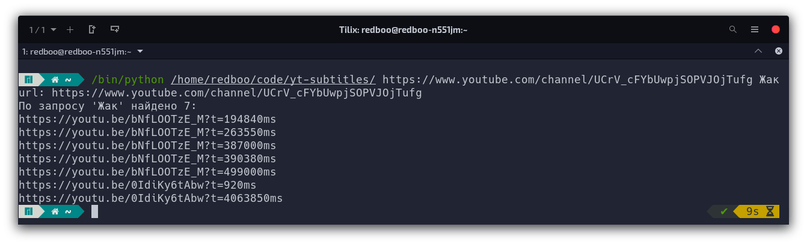

# yt-subtitles

**yt-subtitles** - консольная программа для поиска по субтитрам YouTube видео.



## Подготовка

### Клонировать/создать репозиторий проекта

```sh
git clone https://github.com/redboo/yt-subtitles.git
```

```sh
cd yt-subtitles
```

### Установка Pipenv (по желанию)

#### Linux

```sh
pip install --user pipenv
```

#### Если вы используете Fedora 28

```sh
sudo dnf install pipenv
```

#### MacOS или с Linuxbrew на Linux

```sh
brew install pipenv
```

### Установка зависимостей

#### Установка из `Pipfile`, если он есть и если установлен Pipenv

```sh
pipenv install
```

#### Установка из `requirements.txt` при помощи Pipenv

```sh
pipenv install -r requirements.txt
```

#### Установка из `requirements.txt` при помощи Pip

```sh
pip install -r requirements.txt
```

## Использование

### Параметр `-h` или `--help`

`--help` - выводит описание доступных команд и параметров.

```sh
/bin/python /path/to/yt-subtitles -h
```

### Простое использование

```sh
/bin/python /path/to/yt-subtitles <URL> <QUERY|QUERIES>
```

Пример:

```sh
/bin/python /path/to/yt-subtitles https://www.youtube.com/channel/UCrV_cFYbUwpjSOPVJOjTufg Жак
```

Пример с несколькими запросами:

```sh
/bin/python /path/to/yt-subtitles https://www.youtube.com/channel/UCrV_cFYbUwpjSOPVJOjTufg Жак Вода
```

### Параметр `-o` или `--open`

`--open` - открывает файл с сохраненными результатами после окончания работы скрипта.

```sh
/bin/python /path/to/yt-subtitles <URL> <QUERY|QUERIES> -o
```
